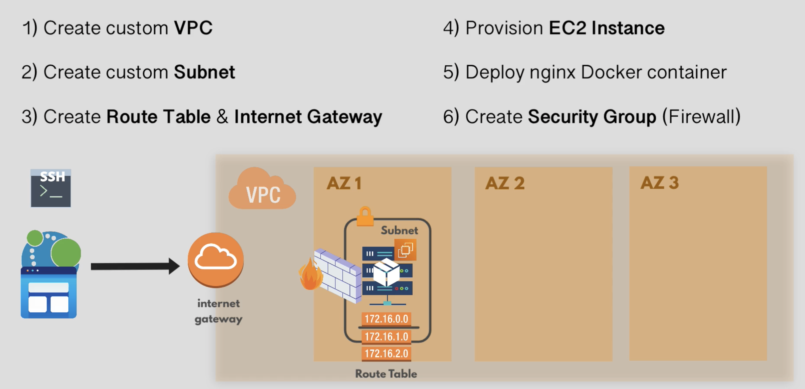

# Terraform
Terraform is an Infrastructure as Code (IAC) tool developed by HashiCorp that enables organizations to provision and manage their infrastructure and services in a declarative and automated manner. Main advantages of using Terraform in  DevOps and cloud computing are simplicity, scalability, and versatility.
Terraform simplifies infrastructure provisioning, automates repetitive tasks, and enhances infrastructure versioning and documentation. It helps organizations achieve infrastructure as code, improving efficiency, consistency, and collaboration within development and operations teams.

### Below setup is implementend in this Terraform code

